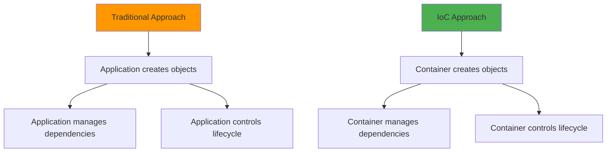
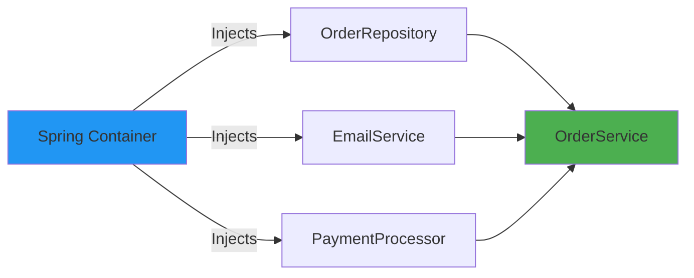
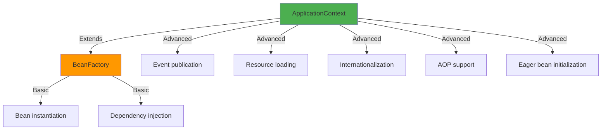
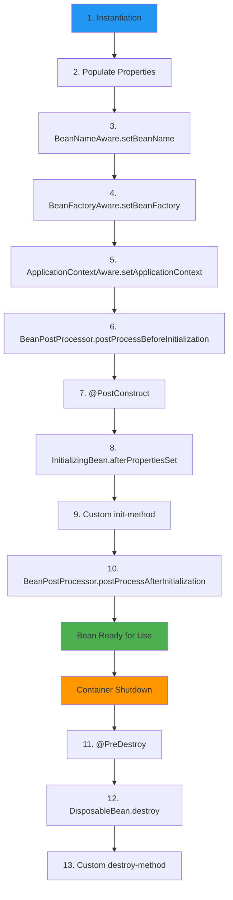
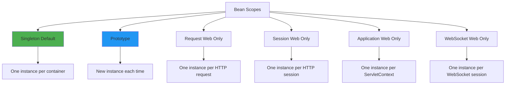

# Spring Framework Core Concepts - Comprehensive Guide

**Modern Annotation-Based Approach**

---

## Table of Contents

1. [Inversion of Control (IoC) & Dependency Injection](#inversion-of-control-ioc--dependency-injection)
2. [Application Context & Bean Factory](#application-context--bean-factory)
3. [Bean Lifecycle & Scopes](#bean-lifecycle--scopes)
4. [Configuration & Component Scanning](#configuration--component-scanning)
5. [Dependency Injection Patterns](#dependency-injection-patterns)
6. [Bean Qualifiers & Disambiguation](#bean-qualifiers--disambiguation)
7. [Properties & Configuration Management](#properties--configuration-management)
8. [Profiles & Conditional Beans](#profiles--conditional-beans)
9. [Bean Post Processors & Customization](#bean-post-processors--customization)
10. [Events & Application Lifecycle](#events--application-lifecycle)
11. [Advanced Topics & Best Practices](#advanced-topics--best-practices)

---

## Inversion of Control (IoC) & Dependency Injection

### What is Inversion of Control?

**IoC** is a design principle where the control of object creation and lifecycle is inverted from the application code to a framework/container.



**Traditional Approach (Without IoC):**
```java
public class OrderService {
    private OrderRepository repository;
    private EmailService emailService;
    private PaymentProcessor paymentProcessor;
    
    public OrderService() {
        // Application creates and manages dependencies
        this.repository = new JdbcOrderRepository();
        this.emailService = new SmtpEmailService();
        this.paymentProcessor = new StripePaymentProcessor();
    }
    
    // Problems:
    // ❌ Tight coupling
    // ❌ Hard to test (can't mock dependencies)
    // ❌ Hard to change implementations
    // ❌ Manual lifecycle management
}
```

**IoC Approach (With Spring):**
```java
@Service
public class OrderService {
    private final OrderRepository repository;
    private final EmailService emailService;
    private final PaymentProcessor paymentProcessor;
    
    // Spring injects dependencies
    public OrderService(OrderRepository repository,
                       EmailService emailService,
                       PaymentProcessor paymentProcessor) {
        this.repository = repository;
        this.emailService = emailService;
        this.paymentProcessor = paymentProcessor;
    }
    
    // Benefits:
    // ✅ Loose coupling
    // ✅ Easy to test (inject mocks)
    // ✅ Easy to change implementations
    // ✅ Container manages lifecycle
}
```

### What is Dependency Injection?

**Dependency Injection** is a pattern where dependencies are provided to an object rather than the object creating them itself.



**Three Types of Dependency Injection:**

#### 1. Constructor Injection (Recommended)
```java
@Service
public class OrderService {
    private final OrderRepository repository;
    private final EmailService emailService;
    
    // Constructor injection - preferred method
    public OrderService(OrderRepository repository, EmailService emailService) {
        this.repository = repository;
        this.emailService = emailService;
    }
}

// Benefits:
// ✅ Immutable (final fields)
// ✅ Required dependencies clear
// ✅ Easy to test
// ✅ Fail-fast if dependency missing
// ✅ No @Autowired needed (Spring 4.3+)
```

#### 2. Setter Injection (Optional Dependencies)
```java
@Service
public class NotificationService {
    private SmsProvider smsProvider;
    private PushNotificationProvider pushProvider;
    
    // Setter injection - for optional dependencies
    @Autowired(required = false)
    public void setSmsProvider(SmsProvider smsProvider) {
        this.smsProvider = smsProvider;
    }
    
    @Autowired(required = false)
    public void setPushProvider(PushNotificationProvider pushProvider) {
        this.pushProvider = pushProvider;
    }
    
    public void sendNotification(String message) {
        // Use SMS if available
        if (smsProvider != null) {
            smsProvider.send(message);
        }
        
        // Use push if available
        if (pushProvider != null) {
            pushProvider.send(message);
        }
    }
}

// Use cases:
// ✅ Optional dependencies
// ✅ Dependencies that may not always be available
// ✅ Circular dependencies (as last resort)
```

#### 3. Field Injection (Not Recommended)
```java
@Service
public class UserService {
    @Autowired
    private UserRepository repository;  // ❌ Avoid this
    
    @Autowired
    private EmailService emailService;  // ❌ Avoid this
}

// Problems:
// ❌ Can't make fields final (immutability lost)
// ❌ Harder to test (need Spring context or reflection)
// ❌ Hides dependencies (not clear from constructor)
// ❌ Can lead to NullPointerException
// ❌ Breaks encapsulation

// Only acceptable in:
// - Spring configuration classes with @Bean methods
// - Test classes with @SpringBootTest
```

**Real-World Best Practice #1: Always Prefer Constructor Injection**

```java
// ❌ BAD - Field injection
@Service
public class OrderService {
    @Autowired
    private OrderRepository repository;
    
    @Autowired
    private EmailService emailService;
}

// ✅ GOOD - Constructor injection
@Service
public class OrderService {
    private final OrderRepository repository;
    private final EmailService emailService;
    
    public OrderService(OrderRepository repository, EmailService emailService) {
        this.repository = repository;
        this.emailService = emailService;
    }
}

// ✅ EVEN BETTER - Lombok
@Service
@RequiredArgsConstructor
public class OrderService {
    private final OrderRepository repository;
    private final EmailService emailService;
    
    // Lombok generates constructor automatically
}
```

---

## Application Context & Bean Factory

### BeanFactory vs ApplicationContext



**BeanFactory (Legacy - Low-level):**
```java
// Basic bean container - rarely used directly
BeanFactory factory = new XmlBeanFactory(new ClassPathResource("beans.xml"));
MyBean bean = factory.getBean(MyBean.class);

// Lazy initialization - beans created on first request
// Minimal features
```

**ApplicationContext (Modern - Full-featured):**
```java
// Full-featured container - use this
ApplicationContext context = new AnnotationConfigApplicationContext(AppConfig.class);
MyBean bean = context.getBean(MyBean.class);

// Eager initialization - beans created at startup
// Full features: events, AOP, i18n, resource loading
```

### Types of ApplicationContext

```java
// 1. AnnotationConfigApplicationContext (Most Common)
// For annotation-based configuration
ApplicationContext context = 
    new AnnotationConfigApplicationContext(AppConfig.class);

// 2. ClassPathXmlApplicationContext (Legacy - XML based)
ApplicationContext context = 
    new ClassPathXmlApplicationContext("applicationContext.xml");

// 3. FileSystemXmlApplicationContext (Legacy - File system XML)
ApplicationContext context = 
    new FileSystemXmlApplicationContext("/path/to/applicationContext.xml");

// 4. WebApplicationContext (For web applications)
// Automatically created by Spring Boot / Spring MVC

// 5. GenericApplicationContext (Programmatic configuration)
GenericApplicationContext context = new GenericApplicationContext();
context.registerBean(MyService.class);
context.refresh();
```

### Creating ApplicationContext

**Using @SpringBootApplication (Recommended):**
```java
@SpringBootApplication
public class Application {
    
    public static void main(String[] args) {
        // Spring Boot creates and manages ApplicationContext
        ApplicationContext context = SpringApplication.run(Application.class, args);
        
        // Access beans
        MyService service = context.getBean(MyService.class);
    }
}
```

**Using @Configuration:**
```java
@Configuration
@ComponentScan(basePackages = "com.example")
@EnableAutoConfiguration
public class AppConfig {
    
    @Bean
    public DataSource dataSource() {
        HikariDataSource ds = new HikariDataSource();
        ds.setJdbcUrl("jdbc:postgresql://localhost:5432/mydb");
        ds.setUsername("user");
        ds.setPassword("password");
        return ds;
    }
}

// Bootstrap
public class Application {
    public static void main(String[] args) {
        ApplicationContext context = 
            new AnnotationConfigApplicationContext(AppConfig.class);
        
        DataSource ds = context.getBean(DataSource.class);
    }
}
```

**Programmatic Registration:**
```java
public class Application {
    public static void main(String[] args) {
        GenericApplicationContext context = new GenericApplicationContext();
        
        // Register beans programmatically
        context.registerBean(UserService.class);
        context.registerBean("customRepo", UserRepository.class);
        
        // Register with supplier
        context.registerBean("emailService", EmailService.class,
            () -> new EmailService("smtp.example.com", 587));
        
        // Refresh to initialize beans
        context.refresh();
        
        // Use beans
        UserService service = context.getBean(UserService.class);
        
        // Close context
        context.close();
    }
}
```

### ApplicationContext Capabilities

#### 1. Bean Management
```java
@Service
public class MyService {
    @Autowired
    private ApplicationContext context;
    
    public void demonstrateFeatures() {
        // Check if bean exists
        boolean exists = context.containsBean("myBean");
        
        // Get bean by name
        Object bean = context.getBean("myBean");
        
        // Get bean by type
        MyRepository repo = context.getBean(MyRepository.class);
        
        // Get bean by name and type
        MyRepository repo2 = context.getBean("myRepo", MyRepository.class);
        
        // Get all beans of a type
        Map<String, MyRepository> allRepos = 
            context.getBeansOfType(MyRepository.class);
        
        // Get bean names
        String[] names = context.getBeanDefinitionNames();
        
        // Check if singleton
        boolean isSingleton = context.isSingleton("myBean");
        
        // Check if prototype
        boolean isPrototype = context.isPrototype("myBean");
    }
}
```

#### 2. Event Publishing
```java
// Custom event
public class OrderCreatedEvent extends ApplicationEvent {
    private final Order order;
    
    public OrderCreatedEvent(Object source, Order order) {
        super(source);
        this.order = order;
    }
    
    public Order getOrder() {
        return order;
    }
}

// Publisher
@Service
public class OrderService {
    private final ApplicationEventPublisher eventPublisher;
    
    public OrderService(ApplicationEventPublisher eventPublisher) {
        this.eventPublisher = eventPublisher;
    }
    
    public Order createOrder(OrderDTO dto) {
        Order order = orderRepository.save(new Order(dto));
        
        // Publish event
        eventPublisher.publishEvent(new OrderCreatedEvent(this, order));
        
        return order;
    }
}

// Listener
@Component
public class OrderEventListener {
    
    @EventListener
    public void handleOrderCreated(OrderCreatedEvent event) {
        Order order = event.getOrder();
        System.out.println("Order created: " + order.getId());
        
        // Send confirmation email, update inventory, etc.
    }
}
```

#### 3. Resource Loading
```java
@Service
public class ResourceService {
    @Autowired
    private ResourceLoader resourceLoader;
    
    public void loadResources() throws IOException {
        // Load from classpath
        Resource resource = resourceLoader.getResource("classpath:data/config.json");
        InputStream is = resource.getInputStream();
        
        // Load from file system
        Resource fileResource = resourceLoader.getResource("file:/path/to/file.txt");
        
        // Load from URL
        Resource urlResource = 
            resourceLoader.getResource("https://example.com/data.json");
        
        // Check if exists
        if (resource.exists()) {
            String content = new String(resource.getInputStream().readAllBytes());
        }
    }
}
```

#### 4. Environment Access
```java
@Service
public class ConfigService {
    @Autowired
    private Environment environment;
    
    public void demonstrateEnvironment() {
        // Get active profiles
        String[] profiles = environment.getActiveProfiles();
        
        // Get property
        String dbUrl = environment.getProperty("database.url");
        
        // Get property with default
        String timeout = environment.getProperty("connection.timeout", "30");
        
        // Get property as specific type
        Integer port = environment.getProperty("server.port", Integer.class);
        
        // Check if property exists
        boolean hasProperty = environment.containsProperty("app.name");
        
        // Get required property (throws exception if missing)
        String required = environment.getRequiredProperty("app.name");
    }
}
```

**Real-World Best Practice #2: Don't Inject ApplicationContext Unnecessarily**

```java
// ❌ BAD - Service locator anti-pattern
@Service
public class OrderService {
    @Autowired
    private ApplicationContext context;
    
    public void processOrder() {
        // Getting beans from context at runtime
        EmailService emailService = context.getBean(EmailService.class);
        PaymentService paymentService = context.getBean(PaymentService.class);
        
        // This is service locator anti-pattern!
    }
}

// ✅ GOOD - Proper dependency injection
@Service
public class OrderService {
    private final EmailService emailService;
    private final PaymentService paymentService;
    
    public OrderService(EmailService emailService, PaymentService paymentService) {
        this.emailService = emailService;
        this.paymentService = paymentService;
    }
    
    public void processOrder() {
        // Dependencies already injected
        emailService.send();
        paymentService.process();
    }
}

// ✅ ACCEPTABLE - When you genuinely need ApplicationContext features
@Service
public class PluginManager {
    @Autowired
    private ApplicationContext context;
    
    public void loadPlugins() {
        // Getting all beans of a plugin type
        Map<String, Plugin> plugins = context.getBeansOfType(Plugin.class);
        
        // This is acceptable - we need to discover all implementations
        plugins.values().forEach(Plugin::initialize);
    }
}
```

---

## Bean Lifecycle & Scopes

### Bean Lifecycle



**Complete Lifecycle Example:**
```java
@Component
public class LifecycleBean implements BeanNameAware, BeanFactoryAware,
                                     ApplicationContextAware, InitializingBean,
                                     DisposableBean {
    
    private String beanName;
    
    // 1. Constructor - Instantiation
    public LifecycleBean() {
        System.out.println("1. Constructor called");
    }
    
    // 2. Property injection happens here (via @Autowired)
    @Autowired
    public void setDependency(SomeDependency dependency) {
        System.out.println("2. Properties populated");
    }
    
    // 3. BeanNameAware
    @Override
    public void setBeanName(String name) {
        this.beanName = name;
        System.out.println("3. BeanNameAware.setBeanName: " + name);
    }
    
    // 4. BeanFactoryAware
    @Override
    public void setBeanFactory(BeanFactory beanFactory) {
        System.out.println("4. BeanFactoryAware.setBeanFactory");
    }
    
    // 5. ApplicationContextAware
    @Override
    public void setApplicationContext(ApplicationContext applicationContext) {
        System.out.println("5. ApplicationContextAware.setApplicationContext");
    }
    
    // 6. BeanPostProcessor.postProcessBeforeInitialization happens here
    
    // 7. @PostConstruct
    @PostConstruct
    public void postConstruct() {
        System.out.println("7. @PostConstruct called");
    }
    
    // 8. InitializingBean
    @Override
    public void afterPropertiesSet() {
        System.out.println("8. InitializingBean.afterPropertiesSet");
    }
    
    // 9. Custom init method
    public void customInit() {
        System.out.println("9. Custom init method");
    }
    
    // 10. BeanPostProcessor.postProcessAfterInitialization happens here
    
    // Bean is now ready for use
    
    // 11. @PreDestroy (on shutdown)
    @PreDestroy
    public void preDestroy() {
        System.out.println("11. @PreDestroy called");
    }
    
    // 12. DisposableBean
    @Override
    public void destroy() {
        System.out.println("12. DisposableBean.destroy");
    }
    
    // 13. Custom destroy method
    public void customDestroy() {
        System.out.println("13. Custom destroy method");
    }
}

@Configuration
public class AppConfig {
    
    @Bean(initMethod = "customInit", destroyMethod = "customDestroy")
    public LifecycleBean lifecycleBean() {
        return new LifecycleBean();
    }
}
```

**Practical Lifecycle Hooks:**

```java
@Service
public class DatabaseConnectionService {
    
    private Connection connection;
    
    // Initialize connection after bean creation
    @PostConstruct
    public void init() {
        try {
            connection = DriverManager.getConnection(
                "jdbc:postgresql://localhost:5432/mydb",
                "user",
                "password"
            );
            System.out.println("Database connection established");
        } catch (SQLException e) {
            throw new RuntimeException("Failed to connect to database", e);
        }
    }
    
    // Clean up connection before bean destruction
    @PreDestroy
    public void cleanup() {
        if (connection != null) {
            try {
                connection.close();
                System.out.println("Database connection closed");
            } catch (SQLException e) {
                System.err.println("Error closing connection: " + e.getMessage());
            }
        }
    }
    
    public void executeQuery(String sql) {
        // Use connection
    }
}
```

### Bean Scopes

Spring provides several bean scopes that define the lifecycle and visibility of beans.



#### 1. Singleton Scope (Default)

```java
@Component
// @Scope("singleton") - implicit default
public class SingletonBean {
    // One instance shared across entire application
}

// Configuration
@Configuration
public class AppConfig {
    
    @Bean
    // @Scope("singleton") - implicit default
    public DatabaseConfig databaseConfig() {
        return new DatabaseConfig();
    }
}

// Usage demonstration
@SpringBootApplication
public class Application {
    public static void main(String[] args) {
        ApplicationContext context = SpringApplication.run(Application.class, args);
        
        SingletonBean bean1 = context.getBean(SingletonBean.class);
        SingletonBean bean2 = context.getBean(SingletonBean.class);
        
        System.out.println(bean1 == bean2);  // true - same instance
        System.out.println(bean1.hashCode() == bean2.hashCode());  // true
    }
}

// Best for:
// ✅ Stateless services
// ✅ Shared configuration
// ✅ Thread-safe utilities
// ✅ Repositories (if stateless)
```

#### 2. Prototype Scope

```java
@Component
@Scope("prototype")
// Or @Scope(ConfigurableBeanFactory.SCOPE_PROTOTYPE)
public class PrototypeBean {
    // New instance created every time bean is requested
}

// Configuration
@Configuration
public class AppConfig {
    
    @Bean
    @Scope("prototype")
    public ReportGenerator reportGenerator() {
        return new ReportGenerator();
    }
}

// Usage demonstration
@SpringBootApplication
public class Application {
    public static void main(String[] args) {
        ApplicationContext context = SpringApplication.run(Application.class, args);
        
        PrototypeBean bean1 = context.getBean(PrototypeBean.class);
        PrototypeBean bean2 = context.getBean(PrototypeBean.class);
        
        System.out.println(bean1 == bean2);  // false - different instances
        System.out.println(bean1.hashCode() == bean2.hashCode());  // false
    }
}

// Best for:
// ✅ Stateful beans
// ✅ Objects with per-request state
// ✅ Command objects
// ✅ Beans that are not thread-safe
```

**Important: Prototype beans in Singleton beans**

```java
// ❌ PROBLEM - Prototype not working as expected
@Service  // Singleton by default
public class OrderService {
    
    @Autowired
    private OrderProcessor processor;  // Prototype scope
    
    // Problem: processor is injected once when OrderService is created
    // Same prototype instance is reused for all requests!
}

// ✅ SOLUTION 1 - Method injection
@Service
public class OrderService {
    
    @Autowired
    private ApplicationContext context;
    
    public void processOrder(Order order) {
        // Get new instance each time
        OrderProcessor processor = context.getBean(OrderProcessor.class);
        processor.process(order);
    }
}

// ✅ SOLUTION 2 - Provider/ObjectFactory
@Service
public class OrderService {
    
    @Autowired
    private ObjectProvider<OrderProcessor> processorProvider;
    
    public void processOrder(Order order) {
        // Get new instance each time
        OrderProcessor processor = processorProvider.getObject();
        processor.process(order);
    }
}

// ✅ SOLUTION 3 - @Lookup method injection
@Service
public abstract class OrderService {
    
    public void processOrder(Order order) {
        OrderProcessor processor = createProcessor();
        processor.process(order);
    }
    
    // Spring will implement this method
    @Lookup
    protected abstract OrderProcessor createProcessor();
}
```

#### 3. Custom Scope

```java
// Define custom scope
public class ThreadScope implements Scope {
    
    private final ThreadLocal<Map<String, Object>> threadScope = 
        ThreadLocal.withInitial(HashMap::new);
    
    @Override
    public Object get(String name, ObjectFactory<?> objectFactory) {
        Map<String, Object> scope = threadScope.get();
        Object bean = scope.get(name);
        
        if (bean == null) {
            bean = objectFactory.getObject();
            scope.put(name, bean);
        }
        
        return bean;
    }
    
    @Override
    public Object remove(String name) {
        Map<String, Object> scope = threadScope.get();
        return scope.remove(name);
    }
    
    @Override
    public void registerDestructionCallback(String name, Runnable callback) {
        // Register cleanup callback
    }
    
    @Override
    public Object resolveContextualObject(String key) {
        return null;
    }
    
    @Override
    public String getConversationId() {
        return Thread.currentThread().getName();
    }
}

// Register custom scope
@Configuration
public class ScopeConfig {
    
    @Bean
    public CustomScopeConfigurer customScopeConfigurer() {
        CustomScopeConfigurer configurer = new CustomScopeConfigurer();
        configurer.addScope("thread", new ThreadScope());
        return configurer;
    }
}

// Use custom scope
@Component
@Scope("thread")
public class ThreadScopedBean {
    // One instance per thread
}
```

**Real-World Best Practice #3: Choose Appropriate Scope**

```java
// ❌ BAD - Stateful singleton (not thread-safe)
@Service  // Singleton by default
public class ReportService {
    private List<String> currentReportData = new ArrayList<>();  // Shared state!
    
    public void generateReport(String userId) {
        currentReportData.clear();  // Race condition!
        currentReportData.addAll(loadData(userId));
        // If multiple threads call this, data gets mixed up!
    }
}

// ✅ GOOD - Stateless singleton
@Service
public class ReportService {
    private final ReportRepository repository;
    
    public ReportService(ReportRepository repository) {
        this.repository = repository;
    }
    
    public Report generateReport(String userId) {
        // No shared state - method parameters and local variables only
        List<String> reportData = loadData(userId);
        return new Report(reportData);
    }
}

// ✅ GOOD - Prototype for stateful bean
@Component
@Scope("prototype")
public class ReportBuilder {
    private final List<String> data = new ArrayList<>();
    
    public ReportBuilder addSection(String section) {
        data.add(section);
        return this;
    }
    
    public Report build() {
        return new Report(new ArrayList<>(data));
    }
}

// Usage with prototype
@Service
public class ReportService {
    @Autowired
    private ObjectProvider<ReportBuilder> builderProvider;
    
    public Report generateReport(String userId) {
        // Get new builder instance
        ReportBuilder builder = builderProvider.getObject();
        
        return builder
            .addSection("Header")
            .addSection("Data for " + userId)
            .addSection("Footer")
            .build();
    }
}
```

**Scope Comparison:**

| Scope | Instances | Lifecycle | Use Case |
|-------|-----------|-----------|----------|
| **Singleton** | One per container | Container lifetime | Stateless services, Configuration |
| **Prototype** | New each request | Caller manages | Stateful objects, Commands |
| **Request** | One per HTTP request | Request lifetime | Request-specific data |
| **Session** | One per HTTP session | Session lifetime | User session data |
| **Application** | One per ServletContext | Application lifetime | Global web app state |

---

## Configuration & Component Scanning

### @Configuration Classes

`@Configuration` classes are the modern equivalent of XML configuration files.

```java
@Configuration
public class AppConfig {
    
    // Bean definition
    @Bean
    public DataSource dataSource() {
        HikariDataSource dataSource = new HikariDataSource();
        dataSource.setJdbcUrl("jdbc:postgresql://localhost:5432/mydb");
        dataSource.setUsername("user");
        dataSource.setPassword("password");
        dataSource.setMaximumPoolSize(10);
        return dataSource;
    }
    
    // Bean with dependency
    @Bean
    public UserRepository userRepository(DataSource dataSource) {
        return new JdbcUserRepository(dataSource);
    }
    
    // Bean with multiple dependencies
    @Bean
    public UserService userService(UserRepository repository,
                                   EmailService emailService,
                                   AuditService auditService) {
        return new UserService(repository, emailService, auditService);
    }
}
```

**@Bean Method Characteristics:**

```java
@Configuration
public class BeanConfig {
    
    // 1. Simple bean
    @Bean
    public SimpleBean simpleBean() {
        return new SimpleBean();
    }
    
    // 2. Bean with custom name
    @Bean(name = "customBeanName")
    // Or @Bean("customBeanName")
    public CustomBean myCustomBean() {
        return new CustomBean();
    }
    
    // 3. Bean with multiple names (aliases)
    @Bean(name = {"dataSource", "ds", "primaryDataSource"})
    public DataSource dataSource() {
        return new HikariDataSource();
    }
    
    // 4. Bean with init and destroy methods
    @Bean(initMethod = "init", destroyMethod = "cleanup")
    public ConnectionPool connectionPool() {
        return new ConnectionPool();
    }
    
    // 5. Bean with scope
    @Bean
    @Scope("prototype")
    public PrototypeBean prototypeBean() {
        return new PrototypeBean();
    }
    
    // 6. Conditional bean
    @Bean
    @ConditionalOnProperty(name = "feature.enabled", havingValue = "true")
    public FeatureService featureService() {
        return new FeatureService();
    }
    
    // 7. Primary bean (default when multiple candidates exist)
    @Bean
    @Primary
    public DataSource primaryDataSource() {
        return new HikariDataSource();
    }
    
    // 8. Lazy bean (not created until first use)
    @Bean
    @Lazy
    public ExpensiveBean expensiveBean() {
        return new ExpensiveBean();
    }
}
```

**Inter-bean Dependencies:**

```java
@Configuration
public class DatabaseConfig {
    
    // Method 1: Direct method call (recommended for same @Configuration class)
    @Bean
    public DataSource dataSource() {
        HikariDataSource ds = new HikariDataSource();
        ds.setJdbcUrl("jdbc:postgresql://localhost:5432/mydb");
        return ds;
    }
    
    @Bean
    public JdbcTemplate jdbcTemplate() {
        // Direct method call
        return new JdbcTemplate(dataSource());
    }
    
    // Method 2: Parameter injection (works across @Configuration classes)
    @Bean
    public UserRepository userRepository(JdbcTemplate jdbcTemplate) {
        return new JdbcUserRepository(jdbcTemplate);
    }
    
    // Method 3: Multiple parameters
    @Bean
    public UserService userService(UserRepository repository,
                                   EmailService emailService) {
        UserService service = new UserService(repository);
        service.setEmailService(emailService);
        return service;
    }
    
    // Method 4: Optional dependency
    @Bean
    public NotificationService notificationService(
            @Autowired(required = false) SmsProvider smsProvider) {
        return new NotificationService(smsProvider);
    }
}
```

### Component Scanning

Component scanning automatically detects and registers beans.

```java
@Configuration
@ComponentScan(basePackages = "com.example.myapp")
public class AppConfig {
    // Spring will scan com.example.myapp and register all components
}

// More specific
@Configuration
@ComponentScan(
    basePackages = {"com.example.service", "com.example.repository"},
    excludeFilters = @ComponentScan.Filter(
        type = FilterType.REGEX,
        pattern = "com.example.service.legacy.*"
    )
)
public class AppConfig {
}

// Type-safe package reference
@Configuration
@ComponentScan(basePackageClasses = {
    ServiceMarker.class,  // Marker interface in service package
    RepositoryMarker.class  // Marker interface in repository package
})
public class AppConfig {
}
```

**Component Stereotypes:**

```java
// 1. @Component - Generic component
@Component
public class GenericComponent {
    // Generic Spring-managed component
}

// 2. @Service - Service layer component
@Service
public class UserService {
    // Business logic layer
    // Same as @Component but conveys semantic meaning
}

// 3. @Repository - Data access layer component
@Repository
public class UserRepository {
    // Data access layer
    // Adds exception translation (converts database exceptions to Spring DataAccessException)
}

// 4. @Controller - Presentation layer (omitted as per requirements - no HTTP concepts)

// All stereotypes are specialized @Component annotations
// They all register the class as a Spring bean
// They differ in semantic meaning and additional features
```

**Component Scan Filters:**

```java
@Configuration
@ComponentScan(
    basePackages = "com.example",
    
    // Include specific components
    includeFilters = {
        @ComponentScan.Filter(type = FilterType.ANNOTATION, 
                             classes = CustomAnnotation.class),
        @ComponentScan.Filter(type = FilterType.ASSIGNABLE_TYPE, 
                             classes = SpecificClass.class),
        @ComponentScan.Filter(type = FilterType.REGEX, 
                             pattern = "com.example.service.*ServiceImpl")
    },
    
    // Exclude specific components
    excludeFilters = {
        @ComponentScan.Filter(type = FilterType.ANNOTATION, 
                             classes = Deprecated.class),
        @ComponentScan.Filter(type = FilterType.CUSTOM, 
                             classes = CustomTypeFilter.class)
    }
)
public class AppConfig {
}

// Custom filter
public class CustomTypeFilter implements TypeFilter {
    
    @Override
    public boolean match(MetadataReader metadataReader,
                        MetadataReaderFactory metadataReaderFactory) {
        // Custom logic to determine if class should be included
        AnnotationMetadata metadata = metadataReader.getAnnotationMetadata();
        return metadata.hasAnnotation("com.example.CustomAnnotation");
    }
}
```

**Real-World Best Practice #4: Organize Configuration Properly**

```java
// ❌ BAD - Single monolithic configuration class
@Configuration
@ComponentScan("com.example")
public class AppConfig {
    
    @Bean
    public DataSource dataSource() { /* ... */ }
    
    @Bean
    public JdbcTemplate jdbcTemplate() { /* ... */ }
    
    @Bean
    public ObjectMapper objectMapper() { /* ... */ }
    
    @Bean
    public CacheManager cacheManager() { /* ... */ }
    
    @Bean
    public TaskExecutor taskExecutor() { /* ... */ }
    
    // 50 more @Bean methods...
    // Hard to maintain, hard to test specific configurations
}

// ✅ GOOD - Modular configuration classes
@Configuration
public class DatabaseConfig {
    
    @Bean
    public DataSource dataSource() {
        // Database configuration
    }
    
    @Bean
    public JdbcTemplate jdbcTemplate(DataSource dataSource) {
        return new JdbcTemplate(dataSource);
    }
}

@Configuration
public class JacksonConfig {
    
    @Bean
    public ObjectMapper objectMapper() {
        ObjectMapper mapper = new ObjectMapper();
        mapper.registerModule(new JavaTimeModule());
        return mapper;
    }
}

@Configuration
public class CacheConfig {
    
    @Bean
    public CacheManager cacheManager() {
        // Cache configuration
    }
}

@Configuration
public class AsyncConfig {
    
    @Bean
    public TaskExecutor taskExecutor() {
        ThreadPoolTaskExecutor executor = new ThreadPoolTaskExecutor();
        executor.setCorePoolSize(5);
        executor.setMaxPoolSize(10);
        executor.setQueueCapacity(25);
        return executor;
    }
}

// Main configuration imports others
@Configuration
@Import({
    DatabaseConfig.class,
    JacksonConfig.class,
    CacheConfig.class,
    AsyncConfig.class
})
@ComponentScan("com.example")
public class AppConfig {
    // Clean and organized
}

// Or use @SpringBootApplication which does this automatically
@SpringBootApplication
public class Application {
    public static void main(String[] args) {
        SpringApplication.run(Application.class, args);
    }
}
```

**Configuration Class Features:**

```java
@Configuration
public class AdvancedConfig {
    
    // 1. @Bean with @Conditional
    @Bean
    @ConditionalOnMissingBean
    public DataSource dataSource() {
        // Only created if no other DataSource bean exists
        return new HikariDataSource();
    }
    
    // 2. @Profile specific beans
    @Bean
    @Profile("dev")
    public DataSource devDataSource() {
        // Only in dev profile
        return new H2DataSource();
    }
    
    @Bean
    @Profile("prod")
    public DataSource prodDataSource() {
        // Only in prod profile
        return new PostgresDataSource();
    }
    
    // 3. @DependsOn
    @Bean
    @DependsOn("dataSource")
    public SchemaInitializer schemaInitializer() {
        // Ensures dataSource is created first
        return new SchemaInitializer();
    }
    
    // 4. @Description
    @Bean
    @Description("Primary data source for the application")
    public DataSource primaryDataSource() {
        return new HikariDataSource();
    }
}
```

---

## Dependency Injection Patterns

### Constructor Injection (Recommended)

**Why Constructor Injection is Best:**

1. **Immutability**: Dependencies can be final
2. **Required Dependencies**: Constructor parameters are mandatory
3. **Testability**: Easy to instantiate in tests
4. **No Spring Dependency**: Can instantiate without Spring
5. **Fail-Fast**: Application won't start if dependencies missing

```java
@Service
public class OrderService {
    private final OrderRepository repository;
    private final PaymentService paymentService;
    private final EmailService emailService;
    
    // Constructor injection - no @Autowired needed (Spring 4.3+)
    public OrderService(OrderRepository repository,
                       PaymentService paymentService,
                       EmailService emailService) {
        this.repository = repository;
        this.paymentService = paymentService;
        this.emailService = emailService;
    }
    
    public Order createOrder(OrderDTO dto) {
        Order order = repository.save(new Order(dto));
        paymentService.processPayment(order);
        emailService.sendConfirmation(order);
        return order;
    }
}

// Easy to test without Spring
public class OrderServiceTest {
    
    @Test
    void testCreateOrder() {
        // Mock dependencies
        OrderRepository repository = mock(OrderRepository.class);
        PaymentService paymentService = mock(PaymentService.class);
        EmailService emailService = mock(EmailService.class);
        
        // Instantiate service without Spring
        OrderService service = new OrderService(repository, paymentService, emailService);
        
        // Test
        OrderDTO dto = new OrderDTO();
        service.createOrder(dto);
        
        verify(repository).save(any(Order.class));
    }
}
```

**With Lombok (Even Better):**

```java
@Service
@RequiredArgsConstructor  // Generates constructor for final fields
public class OrderService {
    private final OrderRepository repository;
    private final PaymentService paymentService;
    private final EmailService emailService;
    
    public Order createOrder(OrderDTO dto) {
        Order order = repository.save(new Order(dto));
        paymentService.processPayment(order);
        emailService.sendConfirmation(order);
        return order;
    }
}
```

### Setter Injection (For Optional Dependencies)

```java
@Service
public class NotificationService {
    private final EmailService emailService;  // Required
    private SmsService smsService;  // Optional
    private PushService pushService;  // Optional
    
    // Constructor for required dependencies
    public NotificationService(EmailService emailService) {
        this.emailService = emailService;
    }
    
    // Setter for optional dependency
    @Autowired(required = false)
    public void setSmsService(SmsService smsService) {
        this.smsService = smsService;
    }
    
    @Autowired(required = false)
    public void setPushService(PushService pushService) {
        this.pushService = pushService;
    }
    
    public void sendNotification(String message, User user) {
        // Always send email (required)
        emailService.send(user.getEmail(), message);
        
        // Send SMS if available
        if (smsService != null && user.getPhone() != null) {
            smsService.send(user.getPhone(), message);
        }
        
        // Send push if available
        if (pushService != null && user.getPushToken() != null) {
            pushService.send(user.getPushToken(), message);
        }
    }
}
```

### Field Injection (Avoid Except in Tests)

```java
// ❌ AVOID in production code
@Service
public class UserService {
    @Autowired
    private UserRepository repository;
    
    @Autowired
    private EmailService emailService;
    
    // Problems:
    // 1. Cannot make fields final
    // 2. Hard to test
    // 3. Hides dependencies
    // 4. Requires Spring or reflection
}

// ✅ ACCEPTABLE in tests
@SpringBootTest
public class UserServiceIntegrationTest {
    
    @Autowired
    private UserService userService;  // OK in tests
    
    @Autowired
    private UserRepository userRepository;  // OK in tests
    
    @Test
    void testUserCreation() {
        // Test with real Spring beans
    }
}
```

### Method Injection

```java
@Component
public class CommandManager {
    
    // Method injection for prototype bean
    public void processCommand() {
        Command command = createCommand();  // New instance each time
        command.execute();
    }
    
    @Lookup
    protected Command createCommand() {
        // Spring implements this method
        // Returns new instance of Command (prototype scope)
        return null;
    }
}

@Component
@Scope("prototype")
class Command {
    public void execute() {
        // Execute command logic
    }
}
```

**Real-World Best Practice #5: Use Constructor Injection with Lombok**

```java
// ❌ BAD - Verbose field injection
@Service
public class OrderService {
    @Autowired
    private OrderRepository orderRepository;
    
    @Autowired
    private PaymentService paymentService;
    
    @Autowired
    private EmailService emailService;
    
    @Autowired
    private InventoryService inventoryService;
    
    @Autowired
    private AuditService auditService;
}

// ✅ GOOD - Constructor injection
@Service
public class OrderService {
    private final OrderRepository orderRepository;
    private final PaymentService paymentService;
    private final EmailService emailService;
    private final InventoryService inventoryService;
    private final AuditService auditService;
    
    public OrderService(OrderRepository orderRepository,
                       PaymentService paymentService,
                       EmailService emailService,
                       InventoryService inventoryService,
                       AuditService auditService) {
        this.orderRepository = orderRepository;
        this.paymentService = paymentService;
        this.emailService = emailService;
        this.inventoryService = inventoryService;
        this.auditService = auditService;
    }
}

// ✅ BETTER - Lombok's @RequiredArgsConstructor
@Service
@RequiredArgsConstructor
public class OrderService {
    private final OrderRepository orderRepository;
    private final PaymentService paymentService;
    private final EmailService emailService;
    private final InventoryService inventoryService;
    private final AuditService auditService;
    
    // Clean, concise, immutable, testable
}

// ✅ BEST - Consider if you have too many dependencies (code smell)
// If you need more than 5-7 dependencies, consider:
// 1. Breaking the class into smaller services
// 2. Using facade pattern
// 3. Grouping related dependencies into configuration objects

@Service
@RequiredArgsConstructor
public class OrderService {
    private final OrderRepository orderRepository;
    private final OrderConfiguration orderConfiguration;  // Groups payment, email, inventory, audit
    
    // Better organization
}

@Component
@RequiredArgsConstructor
class OrderConfiguration {
    private final PaymentService paymentService;
    private final EmailService emailService;
    private final InventoryService inventoryService;
    private final AuditService auditService;
    
    // Getters for services
}
```

---

## Bean Qualifiers & Disambiguation

When multiple beans of the same type exist, Spring needs help determining which one to inject.

### The Problem

```java
// Multiple implementations of same interface
public interface PaymentProcessor {
    void process(Payment payment);
}

@Component
public class CreditCardProcessor implements PaymentProcessor {
    @Override
    public void process(Payment payment) {
        // Credit card logic
    }
}

@Component
public class PayPalProcessor implements PaymentProcessor {
    @Override
    public void process(Payment payment) {
        // PayPal logic
    }
}

@Component
public class StripeProcessor implements PaymentProcessor {
    @Override
    public void process(Payment payment) {
        // Stripe logic
    }
}

// ❌ PROBLEM - Which implementation to inject?
@Service
public class OrderService {
    private final PaymentProcessor processor;
    
    public OrderService(PaymentProcessor processor) {
        // Spring doesn't know which implementation to inject!
        // throws NoUniqueBeanDefinitionException
        this.processor = processor;
    }
}
```

### Solution 1: @Primary

```java
@Component
@Primary  // This will be the default choice
public class StripeProcessor implements PaymentProcessor {
    @Override
    public void process(Payment payment) {
        // Stripe logic
    }
}

@Service
public class OrderService {
    private final PaymentProcessor processor;
    
    public OrderService(PaymentProcessor processor) {
        // Injects StripeProcessor (marked as @Primary)
        this.processor = processor;
    }
}
```

### Solution 2: @Qualifier

```java
// Define qualifiers on implementations
@Component
@Qualifier("creditCard")
public class CreditCardProcessor implements PaymentProcessor {
    // ...
}

@Component
@Qualifier("paypal")
public class PayPalProcessor implements PaymentProcessor {
    // ...
}

@Component
@Qualifier("stripe")
public class StripeProcessor implements PaymentProcessor {
    // ...
}

// Use qualifier in injection
@Service
public class OrderService {
    private final PaymentProcessor creditCardProcessor;
    private final PaymentProcessor paypalProcessor;
    
    public OrderService(@Qualifier("creditCard") PaymentProcessor creditCardProcessor,
                       @Qualifier("paypal") PaymentProcessor paypalProcessor) {
        this.creditCardProcessor = creditCardProcessor;
        this.paypalProcessor = paypalProcessor;
    }
    
    public void processOrder(Order order) {
        if (order.getPaymentMethod() == PaymentMethod.CREDIT_CARD) {
            creditCardProcessor.process(order.getPayment());
        } else if (order.getPaymentMethod() == PaymentMethod.PAYPAL) {
            paypalProcessor.process(order.getPayment());
        }
    }
}
```

### Solution 3: Bean Name Matching

```java
// Bean name matches parameter name
@Component("creditCardProcessor")
public class CreditCardProcessor implements PaymentProcessor {
    // ...
}

@Service
public class OrderService {
    private final PaymentProcessor creditCardProcessor;  // Name matches bean name
    
    public OrderService(PaymentProcessor creditCardProcessor) {
        this.creditCardProcessor = creditCardProcessor;
    }
}
```

### Solution 4: Custom Qualifier Annotations

```java
// Create custom qualifier annotations
@Target({ElementType.FIELD, ElementType.METHOD, ElementType.PARAMETER, ElementType.TYPE})
@Retention(RetentionPolicy.RUNTIME)
@Qualifier
public @interface CreditCard {
}

@Target({ElementType.FIELD, ElementType.METHOD, ElementType.PARAMETER, ElementType.TYPE})
@Retention(RetentionPolicy.RUNTIME)
@Qualifier
public @interface PayPal {
}

@Target({ElementType.FIELD, ElementType.METHOD, ElementType.PARAMETER, ElementType.TYPE})
@Retention(RetentionPolicy.RUNTIME)
@Qualifier
public @interface Stripe {
}

// Use custom qualifiers
@Component
@CreditCard
public class CreditCardProcessor implements PaymentProcessor {
    // ...
}

@Component
@PayPal
public class PayPalProcessor implements PaymentProcessor {
    // ...
}

@Component
@Stripe
public class StripeProcessor implements PaymentProcessor {
    // ...
}

// Inject with custom qualifiers
@Service
public class OrderService {
    private final PaymentProcessor creditCardProcessor;
    private final PaymentProcessor stripeProcessor;
    
    public OrderService(@CreditCard PaymentProcessor creditCardProcessor,
                       @Stripe PaymentProcessor stripeProcessor) {
        this.creditCardProcessor = creditCardProcessor;
        this.stripeProcessor = stripeProcessor;
    }
}
```

### Solution 5: Inject All Implementations

```java
@Service
public class PaymentService {
    private final List<PaymentProcessor> allProcessors;
    private final Map<String, PaymentProcessor> processorMap;
    
    // Inject all implementations as List
    public PaymentService(List<PaymentProcessor> allProcessors) {
        this.allProcessors = allProcessors;
        
        // Create map for easy lookup
        this.processorMap = allProcessors.stream()
            .collect(Collectors.toMap(
                p -> p.getClass().getSimpleName().replace("Processor", "").toLowerCase(),
                p -> p
            ));
    }
    
    public void processPayment(String processorType, Payment payment) {
        PaymentProcessor processor = processorMap.get(processorType);
        if (processor != null) {
            processor.process(payment);
        } else {
            throw new IllegalArgumentException("Unknown processor: " + processorType);
        }
    }
    
    // Process with all processors (e.g., for validation)
    public void validateWithAllProcessors(Payment payment) {
        allProcessors.forEach(processor -> processor.validate(payment));
    }
}

// Alternative: Inject as Map
@Service
public class PaymentService {
    private final Map<String, PaymentProcessor> processors;
    
    // Spring injects Map with bean names as keys
    public PaymentService(Map<String, PaymentProcessor> processors) {
        this.processors = processors;
    }
    
    public void process(String processorName, Payment payment) {
        PaymentProcessor processor = processors.get(processorName);
        processor.process(payment);
    }
}
```

**Real-World Best Practice #6: Use Strategy Pattern with Custom Qualifiers**

```java
// ❌ BAD - Using string literals for qualifiers
@Service
public class PaymentService {
    private final PaymentProcessor processor1;
    private final PaymentProcessor processor2;
    
    public PaymentService(@Qualifier("creditCardProcessor") PaymentProcessor processor1,
                         @Qualifier("paypalProcessor") PaymentProcessor processor2) {
        // String literals are error-prone
        this.processor1 = processor1;
        this.processor2 = processor2;
    }
}

// ✅ GOOD - Custom qualifier annotations
@Target({ElementType.TYPE, ElementType.METHOD, ElementType.PARAMETER})
@Retention(RetentionPolicy.RUNTIME)
@Qualifier
public @interface PaymentMethod {
    PaymentType value();
    
    enum PaymentType {
        CREDIT_CARD,
        PAYPAL,
        STRIPE,
        BANK_TRANSFER
    }
}

@Component
@PaymentMethod(PaymentMethod.PaymentType.CREDIT_CARD)
public class CreditCardProcessor implements PaymentProcessor {
    // ...
}

@Component
@PaymentMethod(PaymentMethod.PaymentType.STRIPE)
public class StripeProcessor implements PaymentProcessor {
    // ...
}

@Service
public class OrderService {
    private final PaymentProcessor creditCardProcessor;
    
    public OrderService(
            @PaymentMethod(PaymentMethod.PaymentType.CREDIT_CARD) 
            PaymentProcessor creditCardProcessor) {
        // Type-safe, compile-time checked
        this.creditCardProcessor = creditCardProcessor;
    }
}

// ✅ EVEN BETTER - Strategy pattern with factory
@Service
public class PaymentProcessorFactory {
    private final Map<PaymentType, PaymentProcessor> processors;
    
    public PaymentProcessorFactory(List<PaymentProcessor> allProcessors) {
        this.processors = new HashMap<>();
        
        allProcessors.forEach(processor -> {
            PaymentMethod annotation = processor.getClass()
                .getAnnotation(PaymentMethod.class);
            if (annotation != null) {
                processors.put(annotation.value(), processor);
            }
        });
    }
    
    public PaymentProcessor getProcessor(PaymentType type) {
        PaymentProcessor processor = processors.get(type);
        if (processor == null) {
            throw new IllegalArgumentException("No processor for: " + type);
        }
        return processor;
    }
}

@Service
public class OrderService {
    private final PaymentProcessorFactory processorFactory;
    
    public OrderService(PaymentProcessorFactory processorFactory) {
        this.processorFactory = processorFactory;
    }
    
    public void processOrder(Order order) {
        PaymentProcessor processor = processorFactory.getProcessor(
            order.getPaymentType());
        processor.process(order.getPayment());
    }
}
```

---

Let me continue with the remaining sections...

## Properties & Configuration Management

### @Value Annotation

The `@Value` annotation injects values from property files, environment variables, or SpEL expressions.

```java
@Component
public class AppConfiguration {
    
    // 1. Simple property injection
    @Value("${app.name}")
    private String appName;
    
    // 2. With default value
    @Value("${app.version:1.0.0}")
    private String appVersion;
    
    // 3. Numeric values
    @Value("${app.max-users:100}")
    private int maxUsers;
    
    @Value("${app.timeout-seconds:30}")
    private long timeoutSeconds;
    
    // 4. Boolean values
    @Value("${app.feature.enabled:false}")
    private boolean featureEnabled;
    
    // 5. List values
    @Value("${app.allowed-origins}")
    private List<String> allowedOrigins;  // Comma-separated: origin1,origin2,origin3
    
    // 6. Array values
    @Value("${app.admin-emails}")
    private String[] adminEmails;
    
    // 7. Map values (SpEL)
    @Value("#{${app.region-codes}}")  // {US: 'United States', UK: 'United Kingdom'}
    private Map<String, String> regionCodes;
    
    // 8. System properties
    @Value("${java.home}")
    private String javaHome;
    
    // 9. Environment variables
    @Value("${HOME}")
    private String homeDirectory;
    
    // 10. SpEL expressions
    @Value("#{systemProperties['user.name']}")
    private String userName;
    
    @Value("#{T(java.lang.Math).random() * 100}")
    private double randomNumber;
    
    // 11. Constructor injection with @Value
    public AppConfiguration(
            @Value("${database.url}") String dbUrl,
            @Value("${database.pool.size:10}") int poolSize) {
        // Initialize with properties
    }
}
```

**application.properties:**
```properties
# Application properties
app.name=MyApplication
app.version=2.0.0
app.max-users=500
app.timeout-seconds=60
app.feature.enabled=true

# List (comma-separated)
app.allowed-origins=http://localhost:3000,https://example.com

# Array (comma-separated)
app.admin-emails=admin@example.com,support@example.com

# Map format for SpEL
app.region-codes={'US': 'United States', 'UK': 'United Kingdom', 'CA': 'Canada'}

# Database
database.url=jdbc:postgresql://localhost:5432/mydb
database.username=dbuser
database.password=dbpass
database.pool.size=20
```

**application.yml:**
```yaml
app:
  name: MyApplication
  version: 2.0.0
  max-users: 500
  timeout-seconds: 60
  feature:
    enabled: true
  allowed-origins:
    - http://localhost:3000
    - https://example.com
  admin-emails:
    - admin@example.com
    - support@example.com
  region-codes:
    US: United States
    UK: United Kingdom
    CA: Canada

database:
  url: jdbc:postgresql://localhost:5432/mydb
  username: dbuser
  password: dbpass
  pool:
    size: 20
```

### @PropertySource

Load properties from specific files:

```java
@Configuration
@PropertySource("classpath:custom.properties")
public class CustomConfig {
    
    @Value("${custom.property}")
    private String customProperty;
}

// Multiple property sources
@Configuration
@PropertySource("classpath:app.properties")
@PropertySource("classpath:database.properties")
public class MultiSourceConfig {
}

// With encoding
@Configuration
@PropertySource(value = "classpath:i18n.properties", encoding = "UTF-8")
public class I18nConfig {
}

// Conditional loading
@Configuration
@PropertySource(
    value = "classpath:optional.properties",
    ignoreResourceNotFound = true
)
public class OptionalConfig {
}
```

### @ConfigurationProperties (Type-Safe Configuration)

```java
// Define configuration class
@ConfigurationProperties(prefix = "database")
@Component
public class DatabaseProperties {
    
    private String url;
    private String username;
    private String password;
    private Pool pool = new Pool();
    private Security security = new Security();
    
    // Getters and setters
    public String getUrl() { return url; }
    public void setUrl(String url) { this.url = url; }
    
    public String getUsername() { return username; }
    public void setUsername(String username) { this.username = username; }
    
    public String getPassword() { return password; }
    public void setPassword(String password) { this.password = password; }
    
    public Pool getPool() { return pool; }
    public void setPool(Pool pool) { this.pool = pool; }
    
    public Security getSecurity() { return security; }
    public void setSecurity(Security security) { this.security = security; }
    
    // Nested classes
    public static class Pool {
        private int minSize = 5;
        private int maxSize = 20;
        private int timeout = 30000;
        
        // Getters and setters
        public int getMinSize() { return minSize; }
        public void setMinSize(int minSize) { this.minSize = minSize; }
        
        public int getMaxSize() { return maxSize; }
        public void setMaxSize(int maxSize) { this.maxSize = maxSize; }
        
        public int getTimeout() { return timeout; }
        public void setTimeout(int timeout) { this.timeout = timeout; }
    }
    
    public static class Security {
        private boolean sslEnabled = true;
        private String trustStore;
        
        // Getters and setters
        public boolean isSslEnabled() { return sslEnabled; }
        public void setSslEnabled(boolean sslEnabled) { this.sslEnabled = sslEnabled; }
        
        public String getTrustStore() { return trustStore; }
        public void setTrustStore(String trustStore) { this.trustStore = trustStore; }
    }
}

// With Lombok (cleaner)
@ConfigurationProperties(prefix = "database")
@Component
@Data
public class DatabaseProperties {
    
    private String url;
    private String username;
    private String password;
    private Pool pool = new Pool();
    private Security security = new Security();
    
    @Data
    public static class Pool {
        private int minSize = 5;
        private int maxSize = 20;
        private int timeout = 30000;
    }
    
    @Data
    public static class Security {
        private boolean sslEnabled = true;
        private String trustStore;
    }
}

// Usage
@Service
public class DatabaseService {
    private final DatabaseProperties dbProperties;
    
    public DatabaseService(DatabaseProperties dbProperties) {
        this.dbProperties = dbProperties;
    }
    
    public void connect() {
        String url = dbProperties.getUrl();
        int poolSize = dbProperties.getPool().getMaxSize();
        boolean sslEnabled = dbProperties.getSecurity().isSslEnabled();
        
        // Use configuration
    }
}
```

**application.yml for above example:**
```yaml
database:
  url: jdbc:postgresql://localhost:5432/mydb
  username: dbuser
  password: dbpass
  pool:
    min-size: 10
    max-size: 50
    timeout: 60000
  security:
    ssl-enabled: true
    trust-store: /path/to/truststore.jks
```

**With Validation:**
```java
@ConfigurationProperties(prefix = "app")
@Component
@Validated
@Data
public class AppProperties {
    
    @NotBlank(message = "Application name is required")
    private String name;
    
    @Min(value = 1, message = "Max users must be at least 1")
    @Max(value = 10000, message = "Max users cannot exceed 10000")
    private int maxUsers;
    
    @Email(message = "Invalid admin email")
    private String adminEmail;
    
    @Pattern(regexp = "^(http|https)://.*", message = "Invalid URL format")
    private String baseUrl;
    
    @Valid
    private Security security;
    
    @Data
    public static class Security {
        @NotNull(message = "JWT secret is required")
        @Size(min = 32, message = "JWT secret must be at least 32 characters")
        private String jwtSecret;
        
        @Min(value = 60, message = "Token expiration must be at least 60 seconds")
        private long tokenExpirationSeconds;
    }
}
```

**@ConfigurationPropertiesScan:**
```java
// Enable scanning for @ConfigurationProperties classes
@SpringBootApplication
@ConfigurationPropertiesScan("com.example.config")
public class Application {
    public static void main(String[] args) {
        SpringApplication.run(Application.class, args);
    }
}

// Now @ConfigurationProperties classes don't need @Component
@ConfigurationProperties(prefix = "app")
@Validated
@Data
public class AppProperties {
    // No @Component needed
}
```

### Environment Abstraction

```java
@Service
public class ConfigurationService {
    private final Environment environment;
    
    public ConfigurationService(Environment environment) {
        this.environment = environment;
    }
    
    public void demonstrateEnvironment() {
        // Get active profiles
        String[] activeProfiles = environment.getActiveProfiles();
        String[] defaultProfiles = environment.getDefaultProfiles();
        
        // Check if profile is active
        boolean isDevProfile = environment.acceptsProfiles(Profiles.of("dev"));
        boolean isProdProfile = environment.acceptsProfiles(Profiles.of("prod"));
        
        // Get properties
        String dbUrl = environment.getProperty("database.url");
        
        // Get with default value
        String timeout = environment.getProperty("connection.timeout", "30");
        
        // Get as specific type
        Integer maxConnections = environment.getProperty(
            "database.max-connections", 
            Integer.class, 
            100  // default
        );
        
        // Get required property (throws exception if missing)
        String apiKey = environment.getRequiredProperty("api.key");
        
        // Check if property exists
        boolean hasApiKey = environment.containsProperty("api.key");
        
        // Get property with placeholder resolution
        String greeting = environment.resolvePlaceholders(
            "Hello ${user.name:Guest}!"
        );
    }
}
```

**Real-World Best Practice #7: Use @ConfigurationProperties Instead of @Value**

```java
// ❌ BAD - Multiple @Value annotations scattered across classes
@Service
public class EmailService {
    @Value("${email.host}")
    private String host;
    
    @Value("${email.port}")
    private int port;
    
    @Value("${email.username}")
    private String username;
    
    @Value("${email.password}")
    private String password;
    
    @Value("${email.from}")
    private String from;
    
    // Problems:
    // - No validation
    // - No IDE autocomplete for property names
    // - Typos only caught at runtime
    // - Hard to see all email-related properties
}

// ✅ GOOD - Centralized, type-safe configuration
@ConfigurationProperties(prefix = "email")
@Component
@Validated
@Data
public class EmailProperties {
    
    @NotBlank
    private String host;
    
    @Min(1)
    @Max(65535)
    private int port = 587;
    
    @NotBlank
    private String username;
    
    @NotBlank
    private String password;
    
    @Email
    private String from;
    
    private boolean tlsEnabled = true;
    
    private int timeout = 5000;
    
    // All email configuration in one place
    // Type-safe, validated, documented
}

@Service
@RequiredArgsConstructor
public class EmailService {
    private final EmailProperties emailProperties;
    
    public void sendEmail(String to, String subject, String body) {
        // Use emailProperties.getHost(), etc.
        // Clean, maintainable, testable
    }
}

// ✅ EVEN BETTER - Group related configurations
@ConfigurationProperties(prefix = "app")
@Component
@Validated
@Data
public class ApplicationProperties {
    
    @Valid
    private Email email = new Email();
    
    @Valid
    private Database database = new Database();
    
    @Valid
    private Security security = new Security();
    
    @Data
    public static class Email {
        @NotBlank
        private String host;
        private int port = 587;
        @NotBlank
        private String username;
        @NotBlank
        private String password;
    }
    
    @Data
    public static class Database {
        @NotBlank
        private String url;
        private int poolSize = 10;
    }
    
    @Data
    public static class Security {
        @NotBlank
        @Size(min = 32)
        private String jwtSecret;
    }
}

// application.yml
/*
app:
  email:
    host: smtp.example.com
    port: 587
    username: user@example.com
    password: secret
  database:
    url: jdbc:postgresql://localhost:5432/mydb
    pool-size: 20
  security:
    jwt-secret: your-very-long-secret-key-here
*/
```

---

## Profiles & Conditional Beans

### @Profile Annotation

Profiles allow different configurations for different environments.

```java
// Profile-specific beans
@Configuration
public class DataSourceConfig {
    
    @Bean
    @Profile("dev")
    public DataSource devDataSource() {
        // H2 in-memory database for development
        return new EmbeddedDatabaseBuilder()
            .setType(EmbeddedDatabaseType.H2)
            .build();
    }
    
    @Bean
    @Profile("test")
    public DataSource testDataSource() {
        // H2 for testing
        return new EmbeddedDatabaseBuilder()
            .setType(EmbeddedDatabaseType.H2)
            .addScript("test-schema.sql")
            .addScript("test-data.sql")
            .build();
    }
    
    @Bean
    @Profile("prod")
    public DataSource prodDataSource() {
        // PostgreSQL for production
        HikariDataSource dataSource = new HikariDataSource();
        dataSource.setJdbcUrl("jdbc:postgresql://prod-server:5432/mydb");
        dataSource.setUsername("prod_user");
        dataSource.setPassword("prod_password");
        dataSource.setMaximumPoolSize(50);
        return dataSource;
    }
    
    @Bean
    @Profile("staging")
    public DataSource stagingDataSource() {
        // Staging database
        HikariDataSource dataSource = new HikariDataSource();
        dataSource.setJdbcUrl("jdbc:postgresql://staging-server:5432/mydb");
        return dataSource;
    }
}

// Profile-specific components
@Service
@Profile("dev")
public class MockEmailService implements EmailService {
    @Override
    public void send(String to, String subject, String body) {
        System.out.println("DEV MODE - Email not sent: " + to);
    }
}

@Service
@Profile("prod")
public class SmtpEmailService implements EmailService {
    @Override
    public void send(String to, String subject, String body) {
        // Real SMTP implementation
    }
}

// Multiple profiles (OR condition)
@Component
@Profile({"dev", "test"})
public class DebugLogger {
    // Active in dev OR test profile
}

// NOT profile
@Component
@Profile("!prod")
public class DebugTools {
    // Active in all profiles EXCEPT prod
}

// Complex profile expressions
@Component
@Profile("dev & debug")
public class DetailedLogging {
    // Active when both dev AND debug profiles are active
}

@Component
@Profile("(dev | test) & !cloud")
public class LocalDevelopmentTools {
    // Active when (dev OR test) AND NOT cloud
}
```

**Activating Profiles:**

```properties
# application.properties
spring.profiles.active=dev,debug

# Or with environment variable
# SPRING_PROFILES_ACTIVE=dev,debug

# Or programmatically
```

```java
@SpringBootApplication
public class Application {
    public static void main(String[] args) {
        SpringApplication app = new SpringApplication(Application.class);
        app.setAdditionalProfiles("dev", "debug");
        app.run(args);
    }
}

// Or
public static void main(String[] args) {
    ConfigurableApplicationContext context = 
        SpringApplication.run(Application.class, args);
    
    ConfigurableEnvironment environment = context.getEnvironment();
    environment.setActiveProfiles("dev", "debug");
}
```

**Profile-Specific Configuration Files:**

```
application.properties              # Default configuration
application-dev.properties          # Development profile
application-test.properties         # Test profile
application-staging.properties      # Staging profile
application-prod.properties         # Production profile

# Or with YAML
application.yml
application-dev.yml
application-test.yml
application-prod.yml
```

```yaml
# application.yml (default)
app:
  name: MyApplication

spring:
  profiles:
    active: dev

---
# application-dev.yml
spring:
  config:
    activate:
      on-profile: dev

app:
  environment: Development
  debug-mode: true

database:
  url: jdbc:h2:mem:testdb

---
# application-prod.yml
spring:
  config:
    activate:
      on-profile: prod

app:
  environment: Production
  debug-mode: false

database:
  url: jdbc:postgresql://prod-server:5432/mydb
```

### Conditional Beans

Spring provides various `@Conditional` annotations for more fine-grained bean creation control.

```java
// 1. @ConditionalOnProperty
@Configuration
public class FeatureConfig {
    
    @Bean
    @ConditionalOnProperty(
        name = "feature.advanced-analytics.enabled",
        havingValue = "true",
        matchIfMissing = false
    )
    public AnalyticsService advancedAnalytics() {
        return new AdvancedAnalyticsService();
    }
    
    @Bean
    @ConditionalOnProperty(
        name = "feature.caching.enabled",
        havingValue = "true"
    )
    public CacheManager cacheManager() {
        return new CaffeineCacheManager();
    }
}

// 2. @ConditionalOnClass (class present in classpath)
@Configuration
public class RedisConfig {
    
    @Bean
    @ConditionalOnClass(name = "redis.clients.jedis.Jedis")
    public RedisConnectionFactory redisConnectionFactory() {
        // Only created if Jedis is in classpath
        return new JedisConnectionFactory();
    }
}

// 3. @ConditionalOnMissingClass
@Configuration
public class FallbackConfig {
    
    @Bean
    @ConditionalOnMissingClass("com.example.CustomCache")
    public CacheManager defaultCacheManager() {
        // Created only if CustomCache is NOT in classpath
        return new ConcurrentMapCacheManager();
    }
}

// 4. @ConditionalOnBean (bean exists)
@Configuration
public class DependentConfig {
    
    @Bean
    @ConditionalOnBean(DataSource.class)
    public JdbcTemplate jdbcTemplate(DataSource dataSource) {
        // Only created if DataSource bean exists
        return new JdbcTemplate(dataSource);
    }
}

// 5. @ConditionalOnMissingBean (bean doesn't exist)
@Configuration
public class AutoConfig {
    
    @Bean
    @ConditionalOnMissingBean
    public UserService userService() {
        // Only created if no UserService bean already exists
        // Useful for providing default implementations
        return new DefaultUserService();
    }
}

// 6. @ConditionalOnExpression (SpEL)
@Configuration
public class AdvancedConfig {
    
    @Bean
    @ConditionalOnExpression("${feature.enabled:false} and '${environment}' != 'prod'")
    public DebugService debugService() {
        return new DebugService();
    }
    
    @Bean
    @ConditionalOnExpression(
        "#{environment.getProperty('app.mode') == 'advanced' " +
        "and environment.acceptsProfiles('prod')}"
    )
    public AdvancedFeatureService advancedFeature() {
        return new AdvancedFeatureService();
    }
}

// 7. @ConditionalOnResource
@Configuration
public class ConfigFileConfig {
    
    @Bean
    @ConditionalOnResource(resources = "classpath:custom-config.xml")
    public CustomConfigLoader configLoader() {
        // Only if custom-config.xml exists
        return new CustomConfigLoader();
    }
}

// 8. @ConditionalOnJava
@Configuration
public class JavaVersionConfig {
    
    @Bean
    @ConditionalOnJava(JavaVersion.SEVENTEEN)
    public ModernJavaService modernService() {
        // Only on Java 17+
        return new ModernJavaService();
    }
}
```

**Custom Conditional:**

```java
// Custom condition
public class OnWindowsCondition implements Condition {
    
    @Override
    public boolean matches(ConditionContext context, 
                          AnnotatedTypeMetadata metadata) {
        String os = context.getEnvironment().getProperty("os.name");
        return os != null && os.toLowerCase().contains("windows");
    }
}

// Custom annotation
@Target({ElementType.TYPE, ElementType.METHOD})
@Retention(RetentionPolicy.RUNTIME)
@Conditional(OnWindowsCondition.class)
public @interface ConditionalOnWindows {
}

// Usage
@Configuration
public class PlatformConfig {
    
    @Bean
    @ConditionalOnWindows
    public FileService windowsFileService() {
        return new WindowsFileService();
    }
    
    @Bean
    @Conditional(OnLinuxCondition.class)
    public FileService linuxFileService() {
        return new LinuxFileService();
    }
}
```

**Real-World Best Practice #8: Use Profiles and Conditionals Strategically**

```java
// ❌ BAD - Too many profile-specific classes
@Service
@Profile("dev")
public class DevUserService {
    // Dev implementation
}

@Service
@Profile("test")
public class TestUserService {
    // Test implementation
}

@Service
@Profile("prod")
public class ProdUserService {
    // Prod implementation
}
// This leads to code duplication and maintenance nightmare

// ✅ GOOD - Single implementation with profile-specific configuration
@Service
@RequiredArgsConstructor
public class UserService {
    private final UserRepository repository;
    private final UserProperties userProperties;
    
    public User createUser(UserDTO dto) {
        User user = new User(dto);
        
        // Behavior varies based on configuration, not code
        if (userProperties.isEmailVerificationRequired()) {
            user.setEmailVerified(false);
            sendVerificationEmail(user);
        } else {
            user.setEmailVerified(true);  // Auto-verify in dev/test
        }
        
        return repository.save(user);
    }
}

@ConfigurationProperties(prefix = "user")
@Component
@Data
public class UserProperties {
    private boolean emailVerificationRequired = true;  // Default for prod
}

// application-dev.yml
/*
user:
  email-verification-required: false
*/

// application-prod.yml
/*
user:
  email-verification-required: true
*/

// ✅ BETTER - Use profiles for infrastructure, not business logic
@Configuration
public class InfrastructureConfig {
    
    // Different data sources per environment
    @Bean
    @Profile("dev")
    public DataSource devDataSource() {
        return new EmbeddedDatabaseBuilder().build();
    }
    
    @Bean
    @Profile("prod")
    public DataSource prodDataSource() {
        // Production database
    }
    
    // Different email providers per environment
    @Bean
    @Profile("dev")
    public EmailService mockEmailService() {
        return new MockEmailService();  // Logs to console
    }
    
    @Bean
    @Profile("prod")
    public EmailService realEmailService() {
        return new SmtpEmailService();  // Real SMTP
    }
}

// Business logic stays the same across environments
@Service
@RequiredArgsConstructor
public class OrderService {
    private final EmailService emailService;  // Injected based on profile
    
    public void processOrder(Order order) {
        // Same business logic everywhere
        // Email implementation varies by profile
        emailService.send(order.getCustomer().getEmail(), 
                         "Order Confirmation", 
                         "Your order has been processed");
    }
}
```

---

## Bean Post Processors & Customization

### BeanPostProcessor

`BeanPostProcessor` allows custom modification of new bean instances.

```java
@Component
public class CustomBeanPostProcessor implements BeanPostProcessor {
    
    private static final Logger log = LoggerFactory.getLogger(CustomBeanPostProcessor.class);
    
    // Called before @PostConstruct and InitializingBean.afterPropertiesSet
    @Override
    public Object postProcessBeforeInitialization(Object bean, String beanName) 
            throws BeansException {
        
        log.debug("Before initialization of bean: {}", beanName);
        
        // You can modify the bean here
        if (bean instanceof Auditable) {
            ((Auditable) bean).setCreatedDate(LocalDateTime.now());
        }
        
        return bean;
    }
    
    // Called after @PostConstruct and InitializingBean.afterPropertiesSet
    @Override
    public Object postProcessAfterInitialization(Object bean, String beanName) 
            throws BeansException {
        
        log.debug("After initialization of bean: {}", beanName);
        
        // You can wrap the bean in a proxy here
        if (bean instanceof Loggable) {
            return createLoggingProxy(bean);
        }
        
        return bean;
    }
    
    private Object createLoggingProxy(Object bean) {
        return Proxy.newProxyInstance(
            bean.getClass().getClassLoader(),
            bean.getClass().getInterfaces(),
            (proxy, method, args) -> {
                log.info("Calling method: {}", method.getName());
                Object result = method.invoke(bean, args);
                log.info("Method {} returned: {}", method.getName(), result);
                return result;
            }
        );
    }
}
```

**Practical Example - Auto-wiring Logger:**

```java
@Component
public class LoggerInjectionPostProcessor implements BeanPostProcessor {
    
    @Override
    public Object postProcessBeforeInitialization(Object bean, String beanName) {
        // Find all @Log annotated fields
        Arrays.stream(bean.getClass().getDeclaredFields())
            .filter(field -> field.isAnnotationPresent(Log.class))
            .forEach(field -> {
                field.setAccessible(true);
                try {
                    field.set(bean, LoggerFactory.getLogger(bean.getClass()));
                } catch (IllegalAccessException e) {
                    throw new RuntimeException("Failed to inject logger", e);
                }
            });
        
        return bean;
    }
}

// Custom annotation
@Target(ElementType.FIELD)
@Retention(RetentionPolicy.RUNTIME)
public @interface Log {
}

// Usage
@Service
public class UserService {
    
    @Log
    private Logger logger;  // Automatically injected!
    
    public void createUser(User user) {
        logger.info("Creating user: {}", user.getUsername());
        // ...
    }
}
```

### BeanFactoryPostProcessor

`BeanFactoryPostProcessor` operates on bean definitions before beans are created.

```java
@Component
public class CustomBeanFactoryPostProcessor implements BeanFactoryPostProcessor {
    
    @Override
    public void postProcessBeanFactory(ConfigurableListableBeanFactory beanFactory) 
            throws BeansException {
        
        // Modify bean definitions before instantiation
        String[] beanNames = beanFactory.getBeanDefinitionNames();
        
        for (String beanName : beanNames) {
            BeanDefinition beanDefinition = beanFactory.getBeanDefinition(beanName);
            
            // Make all singleton beans lazy
            if (beanDefinition.isSingleton()) {
                beanDefinition.setLazyInit(true);
            }
            
            // Add custom metadata
            beanDefinition.setAttribute("processedBy", "CustomProcessor");
        }
    }
}
```

**Practical Example - Property Placeholder:**

```java
@Component
public class EnvironmentPropertyPlaceholder implements BeanFactoryPostProcessor {
    
    @Override
    public void postProcessBeanFactory(ConfigurableListableBeanFactory beanFactory) {
        // Replace ${ENV:property} with environment-specific values
        String[] beanNames = beanFactory.getBeanDefinitionNames();
        
        for (String beanName : beanNames) {
            BeanDefinition bd = beanFactory.getBeanDefinition(beanName);
            MutablePropertyValues pvs = bd.getPropertyValues();
            
            pvs.getPropertyValueList().forEach(pv -> {
                Object value = pv.getValue();
                if (value instanceof String) {
                    String resolved = resolveProperty((String) value);
                    pv.setValue(resolved);
                }
            });
        }
    }
    
    private String resolveProperty(String value) {
        // Custom property resolution logic
        return value;
    }
}
```

### @ImportResource & @Import

```java
// Import other @Configuration classes
@Configuration
@Import({
    DatabaseConfig.class,
    CacheConfig.class,
    SecurityConfig.class
})
public class AppConfig {
}

// Import based on condition
@Configuration
@Import(ConditionalConfigSelector.class)
public class AppConfig {
}

public class ConditionalConfigSelector implements ImportSelector {
    
    @Override
    public String[] selectImports(AnnotationMetadata importingClassMetadata) {
        // Dynamically select which configurations to import
        boolean useRedis = System.getProperty("cache.type", "").equals("redis");
        
        if (useRedis) {
            return new String[] { "com.example.config.RedisConfig" };
        } else {
            return new String[] { "com.example.config.CaffeineConfig" };
        }
    }
}
```

---

Let me complete the guide with the remaining sections...

## Events & Application Lifecycle

### Application Events

Spring provides an event mechanism for loosely coupled communication between beans.

```java
// 1. Custom Event (extends ApplicationEvent)
public class UserRegisteredEvent extends ApplicationEvent {
    private final User user;
    private final String registrationMethod;
    
    public UserRegisteredEvent(Object source, User user, String registrationMethod) {
        super(source);
        this.user = user;
        this.registrationMethod = registrationMethod;
    }
    
    public User getUser() {
        return user;
    }
    
    public String getRegistrationMethod() {
        return registrationMethod;
    }
}

// 2. Or use POJO (Spring 4.2+, no need to extend ApplicationEvent)
public class OrderPlacedEvent {
    private final Order order;
    private final LocalDateTime timestamp;
    
    public OrderPlacedEvent(Order order) {
        this.order = order;
        this.timestamp = LocalDateTime.now();
    }
    
    // Getters
    public Order getOrder() { return order; }
    public LocalDateTime getTimestamp() { return timestamp; }
}

// 3. Event Publisher
@Service
public class UserService {
    private final UserRepository userRepository;
    private final ApplicationEventPublisher eventPublisher;
    
    public UserService(UserRepository userRepository,
                      ApplicationEventPublisher eventPublisher) {
        this.userRepository = userRepository;
        this.eventPublisher = eventPublisher;
    }
    
    public User registerUser(UserDTO dto) {
        User user = userRepository.save(new User(dto));
        
        // Publish event
        eventPublisher.publishEvent(
            new UserRegisteredEvent(this, user, "STANDARD")
        );
        
        return user;
    }
}

// 4. Event Listeners

// Method 1: @EventListener (recommended)
@Component
public class UserEventListener {
    
    private static final Logger log = LoggerFactory.getLogger(UserEventListener.class);
    
    @EventListener
    public void handleUserRegistered(UserRegisteredEvent event) {
        User user = event.getUser();
        log.info("User registered: {} via {}", 
                user.getUsername(), 
                event.getRegistrationMethod());
        
        // Send welcome email
        // Create user profile
        // Log to analytics
    }
    
    // Listen to POJO events
    @EventListener
    public void handleOrderPlaced(OrderPlacedEvent event) {
        Order order = event.getOrder();
        log.info("Order placed: {}", order.getId());
    }
    
    // Conditional listening
    @EventListener(condition = "#event.order.total > 1000")
    public void handleLargeOrder(OrderPlacedEvent event) {
        // Only triggered for orders > $1000
        log.info("Large order detected: {}", event.getOrder().getId());
    }
    
    // Listen to multiple event types
    @EventListener
    public void handleEvents(Object event) {
        if (event instanceof UserRegisteredEvent) {
            handleUserRegistered((UserRegisteredEvent) event);
        } else if (event instanceof OrderPlacedEvent) {
            handleOrderPlaced((OrderPlacedEvent) event);
        }
    }
}

// Method 2: Implement ApplicationListener (older approach)
@Component
public class EmailNotificationListener implements ApplicationListener<UserRegisteredEvent> {
    
    @Override
    public void onApplicationEvent(UserRegisteredEvent event) {
        User user = event.getUser();
        sendWelcomeEmail(user);
    }
    
    private void sendWelcomeEmail(User user) {
        // Send email
    }
}

// 5. Async Event Handling
@Configuration
@EnableAsync
public class AsyncConfig {
    
    @Bean
    public TaskExecutor applicationEventTaskExecutor() {
        ThreadPoolTaskExecutor executor = new ThreadPoolTaskExecutor();
        executor.setCorePoolSize(5);
        executor.setMaxPoolSize(10);
        executor.setQueueCapacity(25);
        executor.setThreadNamePrefix("event-");
        executor.initialize();
        return executor;
    }
}

@Component
public class AsyncEventListener {
    
    @Async
    @EventListener
    public void handleUserRegisteredAsync(UserRegisteredEvent event) {
        // Runs asynchronously in separate thread
        // Doesn't block the publisher
        User user = event.getUser();
        performExpensiveOperation(user);
    }
}

// 6. Transactional Event Listeners
@Component
public class TransactionalEventListener {
    
    @TransactionalEventListener(phase = TransactionPhase.AFTER_COMMIT)
    public void handleAfterCommit(OrderPlacedEvent event) {
        // Only called if transaction commits successfully
        // Safe to send notifications, update external systems
        sendOrderConfirmation(event.getOrder());
    }
    
    @TransactionalEventListener(phase = TransactionPhase.AFTER_ROLLBACK)
    public void handleAfterRollback(OrderPlacedEvent event) {
        // Only called if transaction rolls back
        logFailure(event.getOrder());
    }
    
    @TransactionalEventListener(phase = TransactionPhase.BEFORE_COMMIT)
    public void handleBeforeCommit(OrderPlacedEvent event) {
        // Called before transaction commits
        validateOrder(event.getOrder());
    }
}

// 7. Ordered Event Listeners
@Component
@Order(1)  // Executed first
public class FirstListener {
    
    @EventListener
    public void handle(UserRegisteredEvent event) {
        System.out.println("First listener");
    }
}

@Component
@Order(2)  // Executed second
public class SecondListener {
    
    @EventListener
    public void handle(UserRegisteredEvent event) {
        System.out.println("Second listener");
    }
}
```

### Built-in Spring Events

```java
@Component
public class ApplicationLifecycleListener {
    
    // Application context refreshed and ready
    @EventListener
    public void handleContextRefresh(ContextRefreshedEvent event) {
        System.out.println("Application context refreshed");
        // Perform initialization tasks
    }
    
    // Application context started
    @EventListener
    public void handleContextStarted(ContextStartedEvent event) {
        System.out.println("Application context started");
    }
    
    // Application context stopped
    @EventListener
    public void handleContextStopped(ContextStoppedEvent event) {
        System.out.println("Application context stopped");
        // Cleanup resources
    }
    
    // Application context closed
    @EventListener
    public void handleContextClosed(ContextClosedEvent event) {
        System.out.println("Application context closed");
        // Final cleanup
    }
    
    // Request handled event (web applications)
    @EventListener
    public void handleRequestHandled(RequestHandledEvent event) {
        System.out.println("Request handled: " + event.getDescription());
    }
}
```

**Real-World Best Practice #9: Use Events for Cross-Cutting Concerns**

```java
// ❌ BAD - Tight coupling between services
@Service
public class OrderService {
    private final OrderRepository orderRepository;
    private final EmailService emailService;
    private final SmsService smsService;
    private final InventoryService inventoryService;
    private final AnalyticsService analyticsService;
    private final LoyaltyService loyaltyService;
    private final AuditService auditService;
    
    // Constructor with 7+ dependencies (code smell!)
    public OrderService(/* all dependencies */) {
        // ...
    }
    
    public Order placeOrder(OrderDTO dto) {
        Order order = orderRepository.save(new Order(dto));
        
        // Tightly coupled to all these services
        emailService.sendConfirmation(order);
        smsService.sendNotification(order);
        inventoryService.updateStock(order);
        analyticsService.trackOrder(order);
        loyaltyService.awardPoints(order);
        auditService.log(order);
        
        // Hard to test, hard to maintain, hard to extend
        return order;
    }
}

// ✅ GOOD - Loose coupling with events
@Service
@RequiredArgsConstructor
public class OrderService {
    private final OrderRepository orderRepository;
    private final ApplicationEventPublisher eventPublisher;
    
    // Only 2 dependencies!
    
    public Order placeOrder(OrderDTO dto) {
        Order order = orderRepository.save(new Order(dto));
        
        // Publish event - let other components react
        eventPublisher.publishEvent(new OrderPlacedEvent(order));
        
        return order;
    }
}

// Separate, independent event listeners
@Component
@RequiredArgsConstructor
public class OrderNotificationListener {
    private final EmailService emailService;
    private final SmsService smsService;
    
    @Async
    @EventListener
    public void handleOrderPlaced(OrderPlacedEvent event) {
        Order order = event.getOrder();
        emailService.sendConfirmation(order);
        smsService.sendNotification(order);
    }
}

@Component
@RequiredArgsConstructor
public class OrderInventoryListener {
    private final InventoryService inventoryService;
    
    @TransactionalEventListener(phase = TransactionPhase.AFTER_COMMIT)
    public void handleOrderPlaced(OrderPlacedEvent event) {
        inventoryService.updateStock(event.getOrder());
    }
}

@Component
@RequiredArgsConstructor
public class OrderAnalyticsListener {
    private final AnalyticsService analyticsService;
    private final LoyaltyService loyaltyService;
    
    @Async
    @EventListener
    public void handleOrderPlaced(OrderPlacedEvent event) {
        Order order = event.getOrder();
        analyticsService.trackOrder(order);
        loyaltyService.awardPoints(order);
    }
}

// Benefits:
// ✅ Loose coupling - OrderService doesn't know about listeners
// ✅ Easy to test - mock ApplicationEventPublisher
// ✅ Easy to extend - add new listeners without modifying OrderService
// ✅ Async by default - non-blocking
// ✅ Single Responsibility - each listener has one job
```

### Aware Interfaces

Spring provides "Aware" interfaces to access container features.

```java
@Component
public class SpringAwareBean implements 
        ApplicationContextAware,
        BeanNameAware,
        BeanFactoryAware,
        EnvironmentAware,
        ResourceLoaderAware,
        ApplicationEventPublisherAware {
    
    private ApplicationContext applicationContext;
    private String beanName;
    private BeanFactory beanFactory;
    private Environment environment;
    private ResourceLoader resourceLoader;
    private ApplicationEventPublisher eventPublisher;
    
    @Override
    public void setApplicationContext(ApplicationContext applicationContext) {
        this.applicationContext = applicationContext;
        // Can now access any bean from context
    }
    
    @Override
    public void setBeanName(String name) {
        this.beanName = name;
        // Know your own bean name
    }
    
    @Override
    public void setBeanFactory(BeanFactory beanFactory) {
        this.beanFactory = beanFactory;
        // Access to bean factory
    }
    
    @Override
    public void setEnvironment(Environment environment) {
        this.environment = environment;
        // Access to environment properties
    }
    
    @Override
    public void setResourceLoader(ResourceLoader resourceLoader) {
        this.resourceLoader = resourceLoader;
        // Load resources
    }
    
    @Override
    public void setApplicationEventPublisher(ApplicationEventPublisher eventPublisher) {
        this.eventPublisher = eventPublisher;
        // Publish events
    }
}

// Practical example
@Component
public class DynamicBeanProvider implements ApplicationContextAware {
    
    private ApplicationContext context;
    
    @Override
    public void setApplicationContext(ApplicationContext applicationContext) {
        this.context = applicationContext;
    }
    
    public <T> T getBean(Class<T> type, String qualifier) {
        Map<String, T> beans = context.getBeansOfType(type);
        return beans.get(qualifier);
    }
    
    public <T> List<T> getAllBeans(Class<T> type) {
        return new ArrayList<>(context.getBeansOfType(type).values());
    }
}
```

---

## Advanced Topics & Best Practices

### Bean Circular Dependencies

```java
// ❌ PROBLEM - Circular dependency with constructor injection
@Service
public class ServiceA {
    private final ServiceB serviceB;
    
    public ServiceA(ServiceB serviceB) {
        this.serviceB = serviceB;
    }
}

@Service
public class ServiceB {
    private final ServiceA serviceA;
    
    public ServiceB(ServiceA serviceA) {
        this.serviceA = serviceA;
    }
}
// BeanCurrentlyInCreationException!

// ✅ SOLUTION 1 - Redesign (best)
// Usually indicates design problem - refactor to remove circular dependency
@Service
public class ServiceA {
    private final CommonService commonService;
    
    public ServiceA(CommonService commonService) {
        this.commonService = commonService;
    }
}

@Service
public class ServiceB {
    private final CommonService commonService;
    
    public ServiceB(CommonService commonService) {
        this.commonService = commonService;
    }
}

@Service
public class CommonService {
    // Shared logic extracted here
}

// ✅ SOLUTION 2 - Setter injection (not recommended but works)
@Service
public class ServiceA {
    private ServiceB serviceB;
    
    @Autowired
    public void setServiceB(ServiceB serviceB) {
        this.serviceB = serviceB;
    }
}

// ✅ SOLUTION 3 - @Lazy
@Service
public class ServiceA {
    private final ServiceB serviceB;
    
    public ServiceA(@Lazy ServiceB serviceB) {
        this.serviceB = serviceB;
    }
}

// ✅ SOLUTION 4 - ObjectProvider
@Service
public class ServiceA {
    private final ObjectProvider<ServiceB> serviceBProvider;
    
    public ServiceA(ObjectProvider<ServiceB> serviceBProvider) {
        this.serviceBProvider = serviceBProvider;
    }
    
    public void doSomething() {
        ServiceB serviceB = serviceBProvider.getObject();
        serviceB.someMethod();
    }
}
```

### Factory Beans

```java
// Create complex objects with FactoryBean
public class ComplexObjectFactoryBean implements FactoryBean<ComplexObject> {
    
    private String property1;
    private int property2;
    
    @Override
    public ComplexObject getObject() throws Exception {
        // Complex initialization logic
        ComplexObject obj = new ComplexObject();
        obj.setProperty1(property1);
        obj.setProperty2(property2);
        obj.initialize();
        obj.validate();
        return obj;
    }
    
    @Override
    public Class<?> getObjectType() {
        return ComplexObject.class;
    }
    
    @Override
    public boolean isSingleton() {
        return true;
    }
    
    // Setters for configuration
    public void setProperty1(String property1) {
        this.property1 = property1;
    }
    
    public void setProperty2(int property2) {
        this.property2 = property2;
    }
}

// Configuration
@Configuration
public class FactoryConfig {
    
    @Bean
    public ComplexObjectFactoryBean complexObjectFactory() {
        ComplexObjectFactoryBean factory = new ComplexObjectFactoryBean();
        factory.setProperty1("value1");
        factory.setProperty2(42);
        return factory;
    }
    
    // Usage
    @Bean
    public SomeService someService(ComplexObject complexObject) {
        // complexObject is created by the factory
        return new SomeService(complexObject);
    }
}
```

### Real-World Best Practice #10: Organize Packages Properly

```java
// ❌ BAD - Package by layer (technical)
com.example.myapp
├── controller/
│   ├── UserController.java
│   ├── OrderController.java
│   └── ProductController.java
├── service/
│   ├── UserService.java
│   ├── OrderService.java
│   └── ProductService.java
├── repository/
│   ├── UserRepository.java
│   ├── OrderRepository.java
│   └── ProductRepository.java
└── model/
    ├── User.java
    ├── Order.java
    └── Product.java

// Problems:
// - Hard to see complete feature
// - Changes to feature scattered across packages
// - Hard to delete/move features
// - Doesn't scale well

// ✅ GOOD - Package by feature (functional)
com.example.myapp
├── user/
│   ├── User.java
│   ├── UserService.java
│   ├── UserRepository.java
│   ├── UserController.java
│   └── UserDTO.java
├── order/
│   ├── Order.java
│   ├── OrderService.java
│   ├── OrderRepository.java
│   ├── OrderController.java
│   ├── OrderItem.java
│   └── OrderDTO.java
├── product/
│   ├── Product.java
│   ├── ProductService.java
│   ├── ProductRepository.java
│   ├── ProductController.java
│   └── ProductDTO.java
└── common/
    ├── config/
    ├── exception/
    └── util/

// Benefits:
// ✅ High cohesion - related classes together
// ✅ Easy to understand feature
// ✅ Easy to delete/move feature
// ✅ Better encapsulation
// ✅ Scales well

// ✅ EVEN BETTER - Hexagonal/Clean Architecture
com.example.myapp
├── domain/
│   ├── user/
│   │   ├── User.java (entity)
│   │   ├── UserRepository.java (interface)
│   │   └── UserService.java (domain logic)
│   └── order/
│       ├── Order.java
│       ├── OrderRepository.java
│       └── OrderService.java
├── application/
│   ├── user/
│   │   ├── CreateUserUseCase.java
│   │   ├── UpdateUserUseCase.java
│   │   └── DeleteUserUseCase.java
│   └── order/
│       ├── PlaceOrderUseCase.java
│       └── CancelOrderUseCase.java
├── infrastructure/
│   ├── persistence/
│   │   ├── JpaUserRepository.java (implementation)
│   │   └── JpaOrderRepository.java
│   └── messaging/
│       └── KafkaEventPublisher.java
└── interfaces/
    ├── rest/
    │   ├── UserController.java
    │   └── OrderController.java
    └── dto/
        ├── UserDTO.java
        └── OrderDTO.java
```

### Real-World Best Practice #11: Testing Best Practices

```java
// ✅ Unit Testing with Constructor Injection
@Service
@RequiredArgsConstructor
public class OrderService {
    private final OrderRepository orderRepository;
    private final PaymentService paymentService;
    private final EmailService emailService;
    
    public Order placeOrder(OrderDTO dto) {
        Order order = orderRepository.save(new Order(dto));
        paymentService.processPayment(order);
        emailService.sendConfirmation(order);
        return order;
    }
}

// Easy to test without Spring
public class OrderServiceTest {
    
    private OrderRepository orderRepository;
    private PaymentService paymentService;
    private EmailService emailService;
    private OrderService orderService;
    
    @BeforeEach
    void setUp() {
        orderRepository = mock(OrderRepository.class);
        paymentService = mock(PaymentService.class);
        emailService = mock(EmailService.class);
        
        // No Spring needed!
        orderService = new OrderService(
            orderRepository,
            paymentService,
            emailService
        );
    }
    
    @Test
    void testPlaceOrder() {
        // Arrange
        OrderDTO dto = new OrderDTO();
        Order expectedOrder = new Order(dto);
        when(orderRepository.save(any())).thenReturn(expectedOrder);
        
        // Act
        Order result = orderService.placeOrder(dto);
        
        // Assert
        assertNotNull(result);
        verify(orderRepository).save(any(Order.class));
        verify(paymentService).processPayment(expectedOrder);
        verify(emailService).sendConfirmation(expectedOrder);
    }
}

// Integration testing with Spring
@SpringBootTest
public class OrderServiceIntegrationTest {
    
    @Autowired
    private OrderService orderService;
    
    @Autowired
    private OrderRepository orderRepository;
    
    @Test
    @Transactional
    void testPlaceOrderIntegration() {
        OrderDTO dto = new OrderDTO();
        Order order = orderService.placeOrder(dto);
        
        assertNotNull(order.getId());
        assertTrue(orderRepository.existsById(order.getId()));
    }
}

// Test configuration
@TestConfiguration
public class TestConfig {
    
    @Bean
    @Primary  // Override production bean
    public EmailService mockEmailService() {
        return new MockEmailService();
    }
}
```

### Real-World Best Practice #12: Resource Management

```java
// ✅ Proper resource cleanup
@Component
public class DatabaseConnectionManager {
    
    private Connection connection;
    
    @PostConstruct
    public void init() throws SQLException {
        // Initialize resource
        connection = DriverManager.getConnection(
            "jdbc:postgresql://localhost:5432/mydb",
            "user",
            "password"
        );
        System.out.println("Database connection opened");
    }
    
    @PreDestroy
    public void cleanup() {
        // Clean up resource
        if (connection != null) {
            try {
                connection.close();
                System.out.println("Database connection closed");
            } catch (SQLException e) {
                System.err.println("Error closing connection: " + e.getMessage());
            }
        }
    }
}

// For non-singleton beans
@Component
@Scope(value = "prototype", proxyMode = ScopedProxyMode.TARGET_CLASS)
public class TaskProcessor implements DisposableBean {
    
    private ExecutorService executorService;
    
    public TaskProcessor() {
        executorService = Executors.newFixedThreadPool(5);
    }
    
    @Override
    public void destroy() {
        executorService.shutdown();
        try {
            if (!executorService.awaitTermination(60, TimeUnit.SECONDS)) {
                executorService.shutdownNow();
            }
        } catch (InterruptedException e) {
            executorService.shutdownNow();
            Thread.currentThread().interrupt();
        }
    }
}
```

### Real-World Best Practice #13: Configuration Validation

```java
// ✅ Validate configuration at startup
@ConfigurationProperties(prefix = "app")
@Component
@Validated
@Data
public class AppProperties {
    
    @NotBlank(message = "Application name is required")
    private String name;
    
    @Min(value = 1, message = "Port must be between 1 and 65535")
    @Max(value = 65535, message = "Port must be between 1 and 65535")
    private int port;
    
    @Email(message = "Invalid admin email")
    private String adminEmail;
    
    @Valid
    private Database database;
    
    @Data
    public static class Database {
        @NotBlank(message = "Database URL is required")
        @Pattern(regexp = "^jdbc:.*", message = "Invalid JDBC URL")
        private String url;
        
        @NotBlank(message = "Database username is required")
        private String username;
        
        @NotBlank(message = "Database password is required")
        private String password;
        
        @Min(value = 1, message = "Pool size must be at least 1")
        @Max(value = 100, message = "Pool size cannot exceed 100")
        private int poolSize = 10;
    }
}

// Custom validator
@Component
public class AppPropertiesValidator implements InitializingBean {
    
    @Autowired
    private AppProperties appProperties;
    
    @Override
    public void afterPropertiesSet() {
        // Custom validation logic
        if (appProperties.getPort() == 8080 && 
            "prod".equals(System.getenv("SPRING_PROFILES_ACTIVE"))) {
            throw new IllegalStateException(
                "Port 8080 is not allowed in production");
        }
    }
}
```

---

## Summary & Best Practices Checklist

### IoC & Dependency Injection
- ✅ Always prefer constructor injection over field injection
- ✅ Use `@RequiredArgsConstructor` from Lombok for cleaner code
- ✅ Keep dependencies immutable (final fields)
- ✅ Avoid injecting ApplicationContext (service locator anti-pattern)

### Bean Configuration
- ✅ Use `@ConfigurationProperties` instead of multiple `@Value` annotations
- ✅ Organize configuration into modular `@Configuration` classes
- ✅ Use `@Profile` for environment-specific beans
- ✅ Validate configuration with `@Validated` annotations
- ✅ Choose appropriate bean scope (singleton for stateless, prototype for stateful)

### Component Organization
- ✅ Package by feature, not by layer
- ✅ Use stereotypes meaningfully (`@Service`, `@Repository`)
- ✅ Keep component scanning targeted (avoid scanning entire packages)
- ✅ Use custom qualifier annotations for type safety

### Events & Lifecycle
- ✅ Use events for cross-cutting concerns (loose coupling)
- ✅ Make event listeners async when appropriate
- ✅ Use `@TransactionalEventListener` for transactional boundaries
- ✅ Clean up resources with `@PreDestroy`

### Testing
- ✅ Design for testability (constructor injection enables easy mocking)
- ✅ Separate unit tests (no Spring) from integration tests (with Spring)
- ✅ Use `@TestConfiguration` for test-specific beans

### Performance & Scalability
- ✅ Use lazy initialization judiciously
- ✅ Avoid circular dependencies (indicates design problem)
- ✅ Be mindful of bean scopes and lifecycle
- ✅ Use prototype scope only when necessary

### Code Quality
- ✅ If a class has 5+ dependencies, consider refactoring
- ✅ Use factory pattern for complex object creation
- ✅ Document why beans are conditional or profile-specific
- ✅ Keep business logic separate from infrastructure concerns

---

## Quick Reference

### Essential Annotations

| Annotation | Purpose | Example |
|------------|---------|---------|
| `@Component` | Generic Spring bean | `@Component public class MyBean` |
| `@Service` | Service layer | `@Service public class UserService` |
| `@Repository` | Data access layer | `@Repository public class UserRepo` |
| `@Configuration` | Configuration class | `@Configuration public class Config` |
| `@Bean` | Bean definition | `@Bean public DataSource ds()` |
| `@Autowired` | Dependency injection | Constructor parameter |
| `@Value` | Property injection | `@Value("${app.name}")` |
| `@ConfigurationProperties` | Type-safe config | `@ConfigurationProperties("app")` |
| `@Profile` | Profile-specific | `@Profile("dev")` |
| `@Scope` | Bean scope | `@Scope("prototype")` |
| `@PostConstruct` | Init method | `@PostConstruct void init()` |
| `@PreDestroy` | Cleanup method | `@PreDestroy void cleanup()` |
| `@EventListener` | Event handling | `@EventListener void handle(Event e)` |
| `@Conditional` | Conditional bean | `@ConditionalOnProperty` |

### Dependency Injection

```java
// Constructor injection (preferred)
@Service
@RequiredArgsConstructor
public class MyService {
    private final MyRepository repository;
}

// Setter injection (optional dependencies)
@Autowired(required = false)
public void setOptional(OptionalDep dep) { }

// Field injection (avoid in production, OK in tests)
@Autowired
private MyRepository repository;
```

### Bean Scopes

```java
// Singleton (default)
@Component  // One instance per container

// Prototype
@Component
@Scope("prototype")  // New instance each time

// Custom scope
@Component
@Scope("thread")
```

### Configuration

```java
// Java configuration
@Configuration
@ComponentScan("com.example")
@PropertySource("classpath:app.properties")
public class AppConfig {
    
    @Bean
    public MyService myService() {
        return new MyService();
    }
}

// Type-safe properties
@ConfigurationProperties(prefix = "app")
@Component
@Data
public class AppProperties {
    private String name;
    private int port;
}
```

---

**This comprehensive guide covers modern Spring Framework core concepts with real-world best practices for building maintainable, testable, and scalable applications.**
